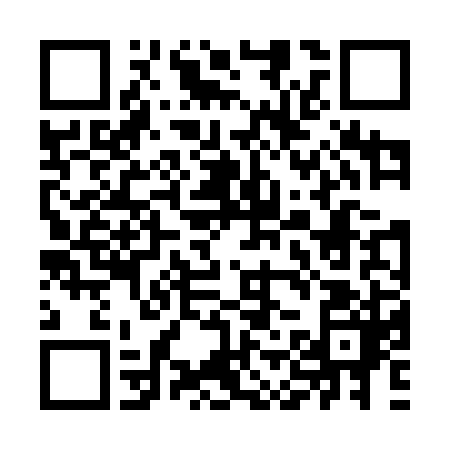
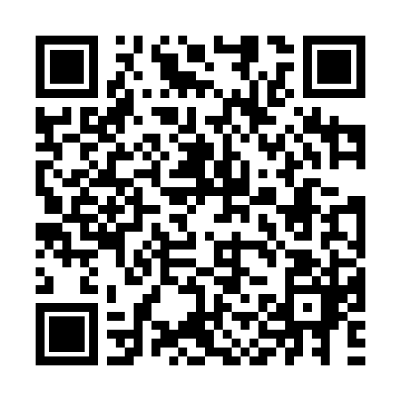

# HAMAC
```
Type: Miscellaneous
Plateform : FCSC
Difficulty : [x] [] [] [] []
Tools : Gimp / Paint
```
#### STEP 1
 - Try to decode the QR code by scanning it with your smartphone
 - We saw that the QR code isn't readable by the camera
#### STEP 2
 - Compare the broken QR code with a random functionnal QR code</br>
 - We can see that the laterals squares in the borken QR code are missing</br>
  <center>
    
    
  </center>
  <center>Broken QR code | Basic QR code</center>

#### STEP 3
- With gimp or another photo editor, we can add the missing squares to the QR code
- Finally, we can decode the QR code with a smartphone</br>
  <center>
    
  </center>
  <center>The Answer Key</center>

#### FLAG
`==> FCSC{0eea6160d40720fe795adfad6371d78b074dac9c234bfd94f6a94c0c72702a2f}`