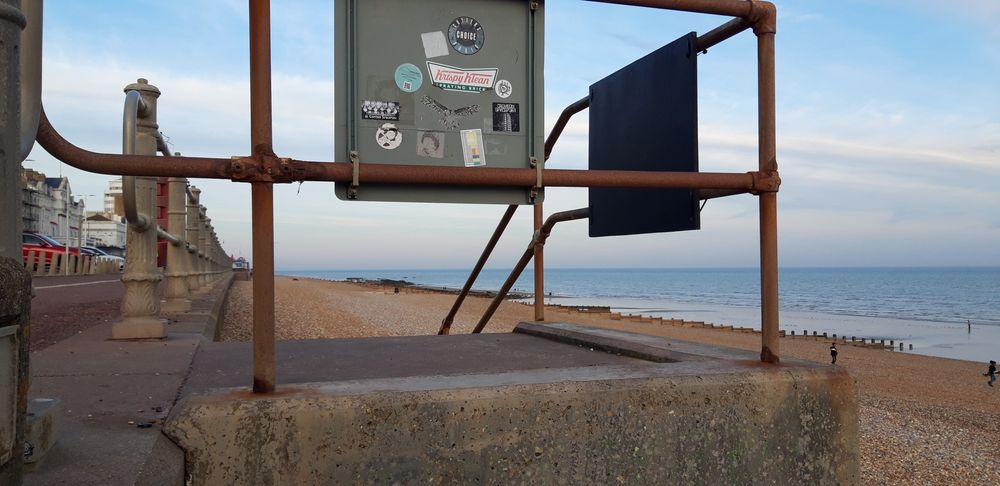
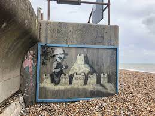

# Stickerz #2
```
Type: OSINT
Plateform : HeroCtf
Difficulty : [x] [x] [] [] []
Tools : Google
```

# DESCRIPTION
```
 - The goal of this challenge is to fine a name of a paint on an image.
 - It's a part of OSINT, it's Geoint
 ```
#### EXPLAINATION

 

We have this image.

What information do we have? : 
- It's in england with the stickers language and with the building architecture.

- We need to find a paint title. In england what's the most famous street artist: Banksy.

- We can read on the stickers on the plate that there is Croydon write multiple time.

- We search on google all the information "Croydon" "Banksy" "Beach"

We found that:



#### FLAG
For the flag we take the name of the painting: Tesco Sandcastle:
Hero{Tesco Sandcastle}
